# ♻️ Fluxo de Trabalho - Github Desktop

1. Vá para o repositório que gostaria de realizar alterações

2. Abra o aplicativo Github Desktop

>> Caso não tenha o aplicativo instalado em sua máquina, instale em: [Github Desktop](https://docs.github.com/en/enterprise-cloud@latest/desktop/installing-and-authenticating-to-github-desktop/installing-github-desktop)

3. Vá em File > Clone repository

  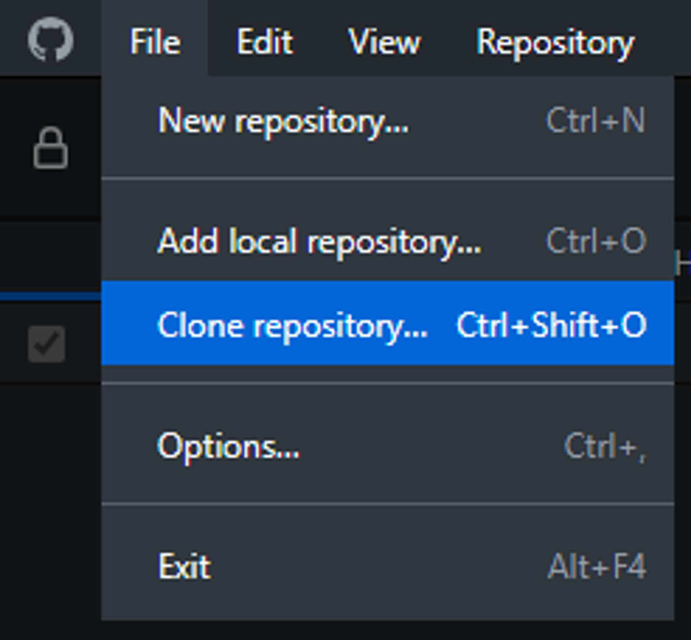

4. Vá para a aba "url"

  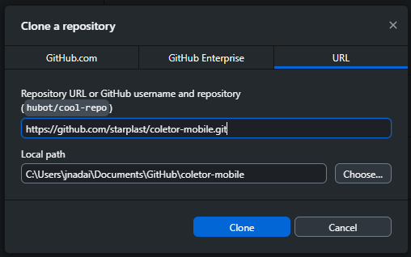

5. Para obter a url, vá para o site do github, na página do repositório e copie o link que está disponível quando clica no botão "code"

  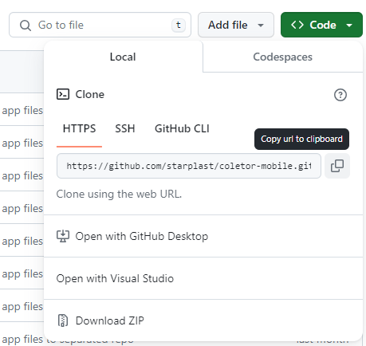

6. Cole o link no campo e pressione o botão "Clone"

  

7. Na tela que foi aberta é possível visualizar qual o repositório no canto superior esquerdo

  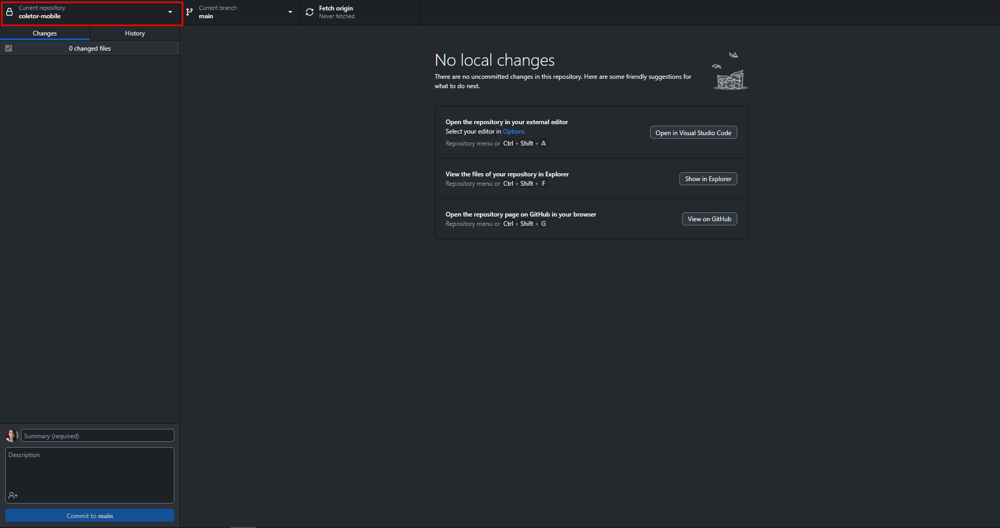

8. É possível visualizar a branch atual no canto superior

  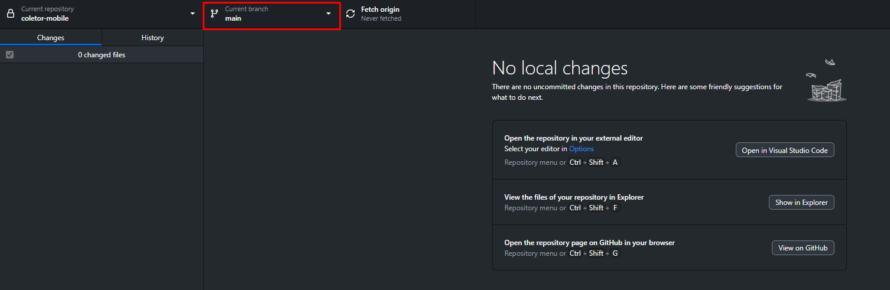

9. Para criar outra branch e visualizar todas, basta clicar em "current branch"

  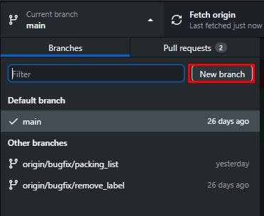

10. Clique no botão "New branch"

11. Preencha o campo com o nome escolhido para a branch. Lembre-se de seguir as converções estipuladas.

  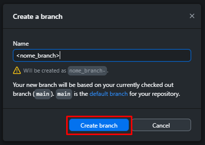

12. Ao criar a nova branch, o github vai automáticamente mudar para a nova branch

  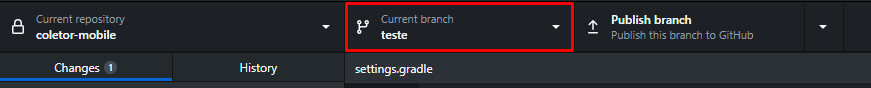

13. Ao realizar suas alterações, é possível visualizar quais arquivos foram alterados e o que foi alterao em cada um deles

  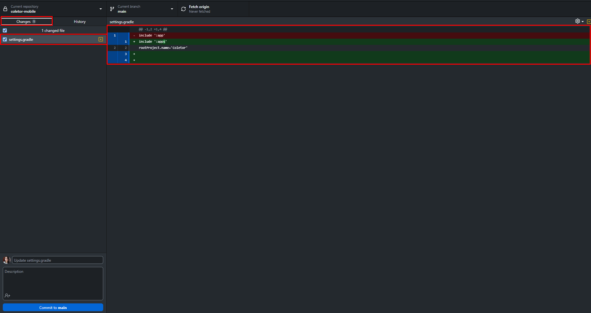

14. Selecione todos os arquivos que gostaria de adicionar ao commit e escreva uma mensagem para o commit.

  

15. Ao finalizar pressione "commit to teste" para adicionar o novo commit a sua branch atual

16. Tendo feito todos os commits, basta enviar suas alterações para o repositório remoto pressionando "Publish branch"

  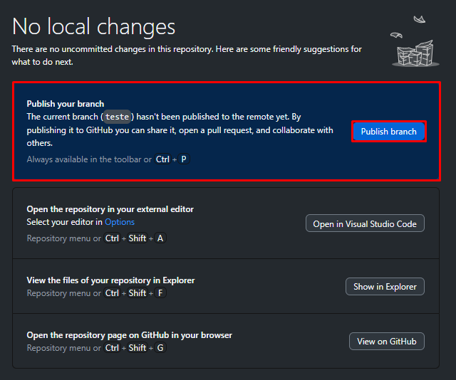

17. Volte à página web

18. Por ter alterações recentes, o github automaticamente vai identificar e perguntar se gostaríamos de criar um pull request para a branch

  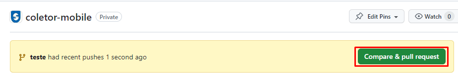

19. Pressione "Compare & pull request"

20. Uma tela irá ser exibida para a criação do pull request, nela é possível verificar com qual branch gostaríamos de mesclar nossa branch pelo campo "base" e qual a nossa branch pelo campo "compare".

  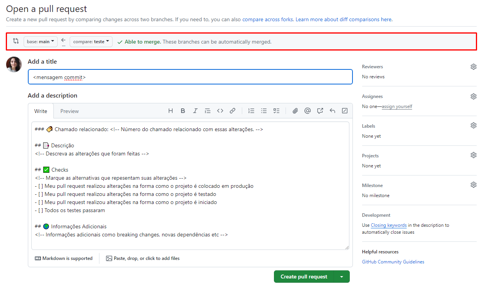

Nesta tela também será exibida a mensagem do pull request, ela já será gerada por padrão, mas é necessário preencher com as informações corretas.

21. Ao finalizar o preenchimento das informações basta pressionar "Create pull request" no canto inferior direito.

22. Após criar o pull request é possível visualizá-lo entrando na aba "Pull requests"

Seu pull request irá aparecer na lista

  

> Obs: Após a criação do pull request, o seu código ainda não irá para a branch principal, ele passará por uma análise e aprovação manual, assim que for aprovado, o código será mesclado.

:rotating_light: **TODAS** as modificações que forem realizadas nos repositórios devem estar atreladas a algum chamado.

:rotating_light: **SEMPRE** que alterações forem realizadas é necessário seguir este fluxo de trabalho

:rotating_light: **SEMPRE** envie suas alterações ao GIT, principalmente se já estiverem aplicadas em **produção**

:rotating_light: **NUNCA** faça commits direto na **main**
